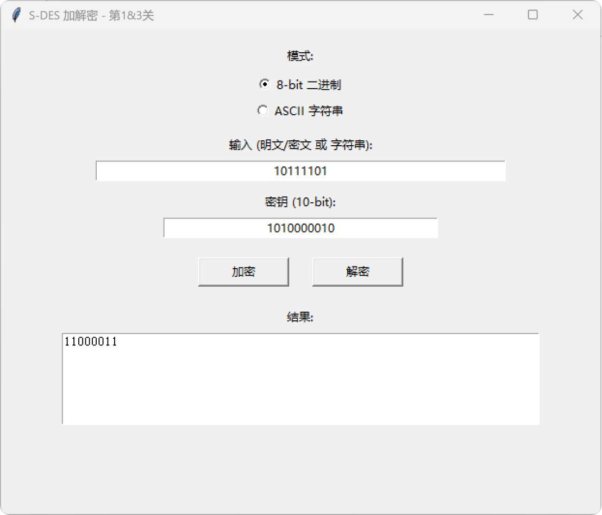

 S-DES 算法实现 —— 作业报告

一、项目概述
项目名称：S-DES 算法实现
小组成员：张瑞淇，何润华，樊帆
完成日期：2026-10-01
仓库地址：https://github.com/wen-yan-chen/sdes-project
本项目使用 Python 实现了 S-DES 简化版数据加密算法，包含基本加解密、ASCII 字符串扩展、暴力破解和封闭测试四个模块，提供 GUI 图形界面供用户交互。项目严格按照课程 PPT 的算法标准实现。

#二、算法原理

分组长度：8-bit
密钥长度：10-bit
加密公式：`C = IP⁻¹( fk₂( SW( fk₁( IP(P) ) ) ) )`
解密公式：`P = IP⁻¹( fk₁( SW( fk₂( IP(C) ) ) ) )`

| 模块         | 说明 |
| 密钥扩展      | 10-bit 主密钥 → K1、K2 |
| 初始/最终置换 | IP 和 IP⁻¹ |
| 轮函数 F     | E/P 扩展 → 异或 → S-box → SP 置换 |
| Feistel 结构 | 两轮 fk + 一次 SW |

三、项目结构与环境
sdes-project/
├── sdes/ # 核心算法包
│ ├── constants.py # 置换表、S-box
│ ├── core.py # 密钥扩展、轮函数
│ ├── cipher.py # 加解密主流程
│ └── string_cipher.py # 字符串加解密
├── gui.py # 第1、3关 GUI
├── brute_force.py # 第4关 暴力破解
├── collision_test.py # 第5关 封闭测试
├── test_run.py # 核心算法自检
├── docs/
│ ├── api.md # 接口文档
│ └── screenshots/ # 测试截图
└── README.md

环境要求：Python 3.8+，Tkinter（自带），Windows / macOS / Linux 均可运行。

 四、测试结果
第1关：基本加解密
目标：用 GUI 完成 8-bit 明文 + 10-bit 密钥的加解密。
测试数据：明文 `10111101`，密钥 `1010000010`

| 步骤 | 输入                     | 输出 |
| 加密 | P=10111101, K=1010000010 | C=11000011 |
| 解密 | C=11000011, K=1010000010 | P=10111101 |

✅ 结论：加解密正确，结果与标准一致。

第2关：交叉测试
目标：验证两组程序对同一组 (P, K) 得到相同密文，并能互相解密。
测试数据：P = `10111101`，K = `1010000010`
详细对比文档：[第二关.docx](docs/screenshots/第二关.docx)

| 组别      | 操作          | 输入                     | 输出 |
| A 组（我） | 加密         | P=10111101, K=1010000010 | C=11000011 |
| B 组（队友）| 加密        | P=10111101, K=1010000010 | C=11000011 |
| A 组（我） | 解密 B 组密文 | C=11000011, K=1010000010 | P=10111101 |

✅ 结论：两组加密结果一致（C 相同），交叉解密成功还原明文 P，算法标准一致。

第3关：ASCII 字符串扩展
目标：将 S-DES 应用到 ASCII 字符串，逐字节加密。
测试数据：字符串 `This is a pen`，密钥 `1010000010`
| 步骤 | 输入          | 输出 |
| 加密 | This is a pen | 112 位二进制密文 |
| 解密 | 上一步密文     | This is a pen |

✅ 结论：字符串逐字节加解密正确，可完整还原。
[第三关](docs/screenshots/第三关.png)

第4关：暴力破解
目标：已知一组明密文对，暴力还原密钥，并记录耗时。
测试数据：明文 `10111101`，密钥 `1010000010`
测试结果：
加密结果: 明文 10111101 + 密钥 1010000010 -> 密文 11000011
暴力破解耗时:   18.05 毫秒
找到 4 个能加密出该密文的密钥:
0000010001
0100010001
1010000010
1110000010
原始密钥 1010000010 在结果中 ✅

✅ 结论：密钥空间 2¹⁰ = 1024，毫秒级完成破解。原始密钥在结果中。
[第四关](docs/screenshots/第四关.png)

第5关：封闭测试
目标：分析是否存在多个密钥对应同一密文（密钥碰撞）。
测试结果：
明文: 10111101
总密钥数: 1024
不同密文数: 254

密钥数量分布:
一个密文对应 2 个密钥: 共有 40 个这样的密文
一个密文对应 4 个密钥: 共有 172 个这样的密文
一个密文对应 6 个密钥: 共有 40 个这样的密文
一个密文对应 8 个密钥: 共有 2 个这样的密文

✅ 结论：S-DES 中密钥不唯一。同一明文分组可被不同密钥加密为同一密文，因此单靠一组明密文对无法唯一确定密钥。
[第五关](docs/screenshots/第五关.png)

五、用户指南
5.1 启动 GUI
python gui.py

5.2 基本加解密（第1关）
模式选 8-bit 二进制
输入明文（8 位二进制）和密钥（10 位二进制）
点【加密】得密文；把密文填回输入框点【解密】还原明文

5.3 ASCII 字符串（第3关）
模式选 ASCII 字符串
输入任意字符串 + 10 位密钥
点【加密】得二进制密文；粘回输入框点【解密】还原字符串

5.4 暴力破解（第4关）
bash
python brute_force.py
按提示输入明文和密钥，程序会输出耗时和所有能加密出该密文的密钥。

5.5 封闭测试（第5关）
bash
python collision_test.py
程序会统计 1024 个密钥对同一明文的密文分布，输出密钥碰撞情况。

六、接口文档
函数	作用
sdes.cipher.encrypt(plain_bits, key_bits)	8-bit 明文 → 8-bit 密文
sdes.cipher.decrypt(cipher_bits, key_bits)	8-bit 密文 → 8-bit 明文
sdes.string_cipher.encrypt_string(text, key_bits)	字符串 → 二进制密文串
sdes.string_cipher.decrypt_string(binary_str, key_bits)	二进制密文串 → 字符串
sdes.core.key_expansion(key_10)	10-bit 密钥 → K1、K2
详细接口文档见 docs/api.md。

七、总结与反思
完成情况：
✅ 第1关：基本加解密
✅ 第2关：交叉测试
✅ 第3关：ASCII 字符串扩展
✅ 第4关：暴力破解
✅ 第5关：封闭测试

收获：
1、理解了 S-DES 的密钥扩展、轮函数、Feistel 结构
2、掌握了分组密码的基本设计思想
3、认识到密钥空间大小与安全性的关系（S-DES 密钥不唯一）
4、实践了暴力破解和密钥碰撞分析

八、参考资料
1、《信息安全导论》课程第 5 次课 PPT
2、S-DES 算法标准文档
3、GitHub 仓库：https://github.com/wen-yan-chen/sdes-project

